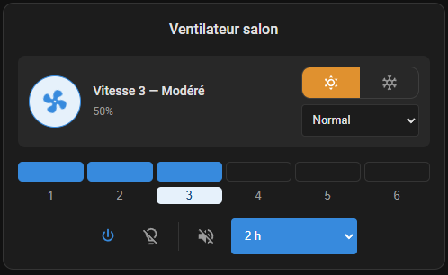

# Custom Fan Card

A custom Home Assistant card to control smart ceiling fans. Built for the
CREATE Windcalm and Klassfan 6-speed fans, it adapts to any `fan` entity: the
number of speeds, the season toggle, presets, oscillation and the power button
all follow what the entity reports.



## Features

- Speed bar with one numbered step per fan speed, derived from the entity's
  `percentage_step` (6 steps when it is not reported); named speeds
  (Gentle … Turbo) on 6-speed fans, "Speed N" otherwise
- Animated fan icon that spins faster with speed (still when the browser asks
  for reduced motion)
- Summer/winter toggle in the status header, with configurable mapping to the fan's actual rotation direction
- Preset mode selector (e.g. Sleep, Nature) in the header, for fans that support it
- Compact control bar: power, oscillation, light, sound beep, and stop timer
- Every control appears only if the fan supports it (`supported_features`):
  no speed bar on an on/off fan, no power button on a fan that cannot be
  turned on or off, an oscillation toggle on oscillating fans
- Light color-temperature slider, shown when the light is on and supports it
- Controls that don't apply while the fan is off (light, sound, preset, timer, direction) are disabled automatically;
  a fan in `unknown` state counts as off and unavailable
- Colours follow the Home Assistant theme, light or dark
- Language auto-detected from Home Assistant (`fr` / `en`)
- Visual editor in the HA dashboard UI, including the related entities

## Compatibility

- Home Assistant **2024.8 or newer** (the power button relies on the
  `TURN_ON` / `TURN_OFF` fan features introduced in 2024.8).
- Any `fan` entity. Speeds, direction, presets and oscillation are shown when
  the entity's `supported_features` declare them. Fans with more than 10
  speed steps (continuous speed) get a 6-step bar.
- Browsers supporting CSS `color-mix()` (all evergreen browsers and the
  current Home Assistant companion apps).

## Installation

### HACS (recommended)

1. Add this repository to HACS as a custom **Dashboard** (frontend) repository.
2. Search for **Custom Fan Card** and install it.
3. HACS automatically registers the JS resource.

### Manual installation

1. Download `dist/custom-fan-card.js` from this repository.
2. Copy it to `<config>/www/custom-fan-card.js` on your Home Assistant host
   (create the `www` folder if needed, then restart Home Assistant once so
   `/local/` is served).
3. Go to **Settings → Dashboards → ⋮ → Resources → Add resource**, enter
   `/local/custom-fan-card.js?v=1.1.0` and choose **JavaScript module**.
   Change the `?v=` value after each update to bypass the browser cache.
4. Refresh the browser. The browser console prints
   `CUSTOM-FAN-CARD v1.1.0`: check that it shows the version you installed.

## Configuration

Only `fan_entity` is required. The light, timer, and sound entities are
auto-discovered from the fan's base object id, so you can drop one card per fan
with a single line of config. Add a second card for a second fan, etc.

### Minimal

```yaml
type: custom:custom-fan-card
fan_entity: fan.ceiling_fan_with_light
```

### Full

```yaml
type: custom:custom-fan-card
fan_entity: fan.ceiling_fan_with_light
name: Ventilateur salon # optional — defaults to the fan's friendly name
show_name: true # optional — default: true
summer_direction: forward # optional — default: forward. Set to "reverse" if the fan's "reverse" direction is what actually cools the room in summer.
light_independent: false # optional — default: false. Set to true if the light works while the fan is off.
light_entity: light.ceiling_fan_with_light # optional — overrides auto-discovery
timer_entity: number.ceiling_fan_with_light_minuteur # optional — number or select entity
sound_entity: switch.ceiling_fan_with_light_son # optional — overrides auto-discovery
```

### Options

| Option              | Type    | Default           | Description                                                                       |
| ------------------- | ------- | ----------------- | --------------------------------------------------------------------------------- |
| `fan_entity`        | string  | **required**      | The `fan` entity to control.                                                      |
| `name`              | string  | fan friendly name | Card title.                                                                       |
| `show_name`         | boolean | `true`            | Show the card title.                                                              |
| `summer_direction`  | string  | `forward`         | Which raw direction (`forward` / `reverse`) is summer mode.                       |
| `light_independent` | boolean | `false`           | Keep the light button and colour-temperature slider usable while the fan is off. |
| `light_entity`      | string  | auto-discovered   | `light` entity of the fan.                                                        |
| `timer_entity`      | string  | auto-discovered   | Stop-timer entity (`number` or `select`).                                         |
| `sound_entity`      | string  | auto-discovered   | `switch` entity of the audible beep.                                              |

The visual editor asks for the fan entity, the card name, the "show name"
toggle, the light, timer and beep entities, the "light works while the fan is
off" toggle and — only when the fan entity supports the `direction` feature —
the summer rotation direction. The entity pickers are pre-filled with what
auto-discovery found; a discovered entity is only written to the YAML if you
pick a different one, so discovery keeps working if you rename things later.
The "Auto-discovered entities" panel shows what was found, and lists the
candidates when the match is ambiguous.

### Summer / winter mode

Instead of raw "Normal / Reverse" labels, the card shows a sun/snowflake
toggle in the status header for fans that support the `direction` feature.
Since not every fan spins counter-clockwise for summer, `summer_direction`
lets you tell the card which of the fan's two raw directions (`forward` or
`reverse`) corresponds to summer mode — the card then maps the toggle to
the right one and calls `fan.set_direction` accordingly.

### Preset mode

If the fan entity declares `preset_modes` and supports the `PRESET_MODE`
feature, a preset dropdown appears in the header, below the summer/winter
toggle — no extra config needed. Picking a preset calls `fan.set_preset_mode`;
picking a speed on the speed bar hands control back to `fan.set_percentage`.

A preset literally named `normal` (case-insensitive) is treated as "no active
preset" — the header shows the current speed instead of the preset name. This
matches fans (e.g. Klassfan) that expose their default manual mode as a
`normal` preset alongside real presets like `sleep` or `nature`.

### Light

The CREATE Windcalm and Klassfan kits cut the light together with the fan, so
by default the light button is disabled while the fan is off. Set
`light_independent: true` for fans whose light works on its own.

### Auto-discovery

From `fan.ceiling_fan_with_light` the card extracts the base id
`ceiling_fan_with_light` and, for each role, looks for:

1. an entity named exactly like the fan (`light.ceiling_fan_with_light`; light
   and timer only — a switch named like the fan is its power switch);
2. otherwise, among entities named `<base>_…`, the one with a known suffix:
   `light` / `lumiere` / `lamp` for the light, `timer` / `minuteur` /
   `countdown` for the timer, `sound` / `son` / `beep` / `bip` / `buzzer` for
   the beep — e.g. `number.ceiling_fan_with_light_minuteur`,
   `switch.ceiling_fan_with_light_son`;
3. otherwise, the only remaining `<base>_…` entity of the domain, unless its
   suffix names another feature (`oscillation`, `swing`, `child_lock`, …) or
   another role.

Entities of another fan whose name extends this one are ignored: with
`fan.ceiling_fan` and `fan.ceiling_fan_2`, the first card never picks
`light.ceiling_fan_2_light`. When several entities match equally well, the
card picks none and the editor lists the candidates: choose one in the
editor (or with `light_entity`, `timer_entity`, `sound_entity`). Controls for
entities that aren't found are simply hidden.

The stop timer is looked up first in the `number` domain (used by the CREATE
Windcalm fan), then in the `select` domain — some fans (e.g. Klassfan via
`select.klassfan_ceiling_fan_minuteur`) expose the timer as a select entity
with its own predefined list of options instead of a free-form number. The
card detects which domain the resolved timer entity belongs to and calls
`number.set_value` or `select.select_option` accordingly, rendering whatever
options the select entity itself reports. A `number` timer set to a value
outside the card's presets (e.g. 45 min) is shown as is.

## Entities

| Entity                                   | Role                         |
| ---------------------------------------- | ---------------------------- |
| `fan.ceiling_fan_with_light`             | Fan on/off + speed (0–100 %) |
| `light.ceiling_fan_with_light`           | Ceiling light on/off         |
| `number.ceiling_fan_with_light_minuteur` | Stop timer (minutes)         |
| `switch.ceiling_fan_with_light_son`      | Audible beep on action       |

Preset mode and oscillation aren't separate entities — they're read from the
`fan` entity's own attributes and supported features, so there's nothing to
auto-discover or override for them.

### Speed mapping

The fan entity uses a 0–100 % percentage. The number of speeds is
`100 / percentage_step` as reported by Home Assistant (6 if the fan does not
report it). A 6-speed fan gets named speeds:

| Speed | Percentage | FR label  | EN label |
| ----- | ---------- | --------- | -------- |
| Off   | 0 %        | Arrêt     | Off      |
| 1     | 17 %       | Très doux | Gentle   |
| 2     | 33 %       | Doux      | Soft     |
| 3     | 50 %       | Modéré    | Moderate |
| 4     | 67 %       | Moyen     | Normal   |
| 5     | 83 %       | Fort      | Strong   |
| 6     | 100 %      | Turbo     | Turbo    |

Other speed counts get numbered labels ("Speed 2" / "Vitesse 2"); a 3-speed
fan shows 33 / 67 / 100 %. Clicking speed *n* sends
`floor(n × 100 / speeds)` % to `fan.set_percentage` (16, 33, 50, 66, 83, 100 on
6 speeds), the same value the Home Assistant UI sends: it is the upper bound
of speed *n* for every integration, whether it rounds, rounds up or uses
Home Assistant's ordered speed lists.

### Theming

Colours come from the active Home Assistant theme (`--primary-color`,
`--orange-color`, `--text-primary-color`, `--card-background-color`,
`--primary-text-color`), so the card renders correctly on light and dark
themes. Two variables can be overridden from a theme or with card-mod:

| Variable                   | Default                | Used for                   |
| -------------------------- | ---------------------- | -------------------------- |
| `--custom-fan-card-accent` | `var(--primary-color)` | Speed bar, active controls |
| `--custom-fan-card-summer` | `var(--orange-color)`  | Active summer button       |

## Development

### DevContainer (Recommended)

To test the card in an isolated Home Assistant environment:

1. Open the project in VS Code
2. Install the **Dev Containers** extension
3. Build the card on your host first: `npm install && npm run build`
4. Click **"Reopen in Container"**
5. Home Assistant will be available at `http://localhost:8123`

See [.devcontainer/README.md](.devcontainer/README.md) for full details.

### Checks

```bash
npm ci
npm run typecheck   # tsc on sources and tests
npm run lint        # ESLint
npm test            # Vitest (jsdom)
npm run build       # rebuilds dist/custom-fan-card.js
```

`dist/custom-fan-card.js` is committed because HACS serves it from the
repository: rebuild and commit it with every source change. CI fails when the
committed bundle differs from a fresh build. `npm run watch` also writes a
sourcemap for local debugging; it is git-ignored and never published.

## Changelog

See [CHANGELOG.md](CHANGELOG.md).

## License

[MIT](LICENSE)
